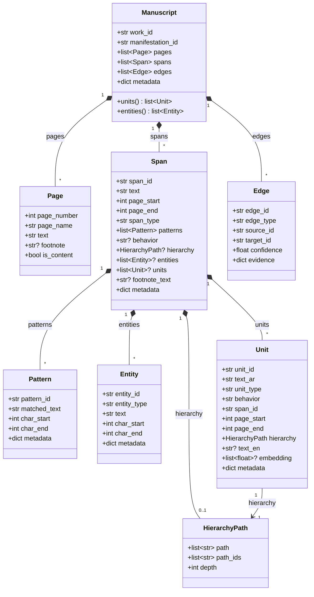
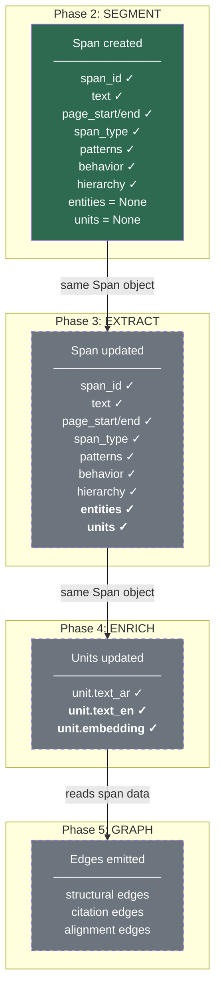
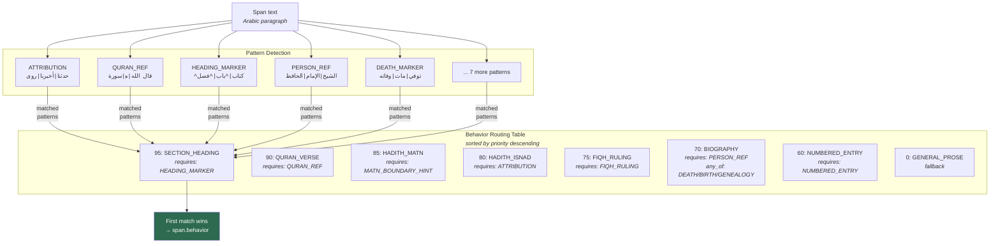
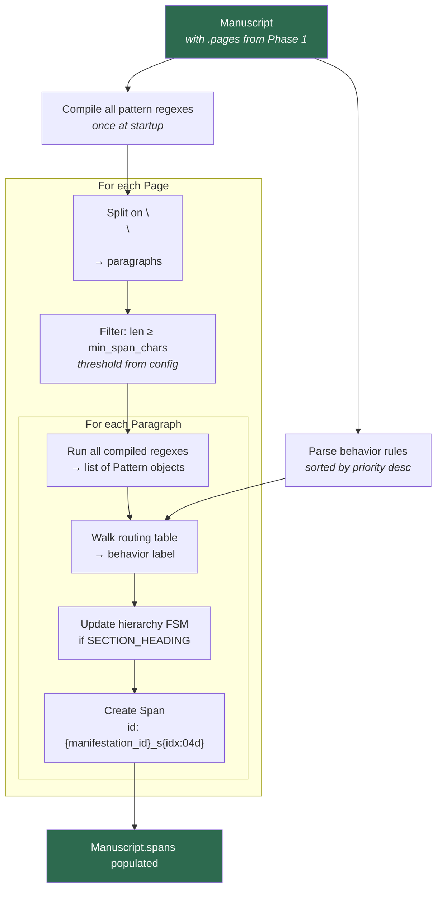
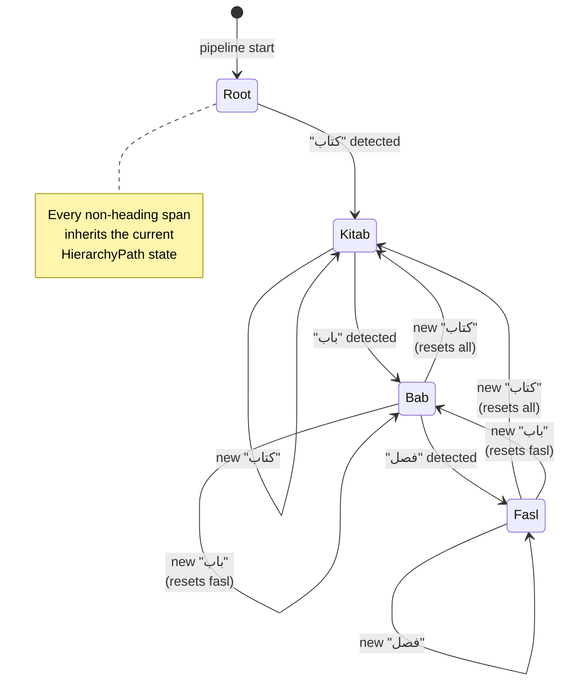
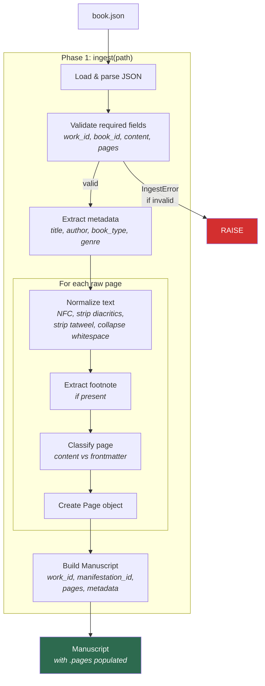
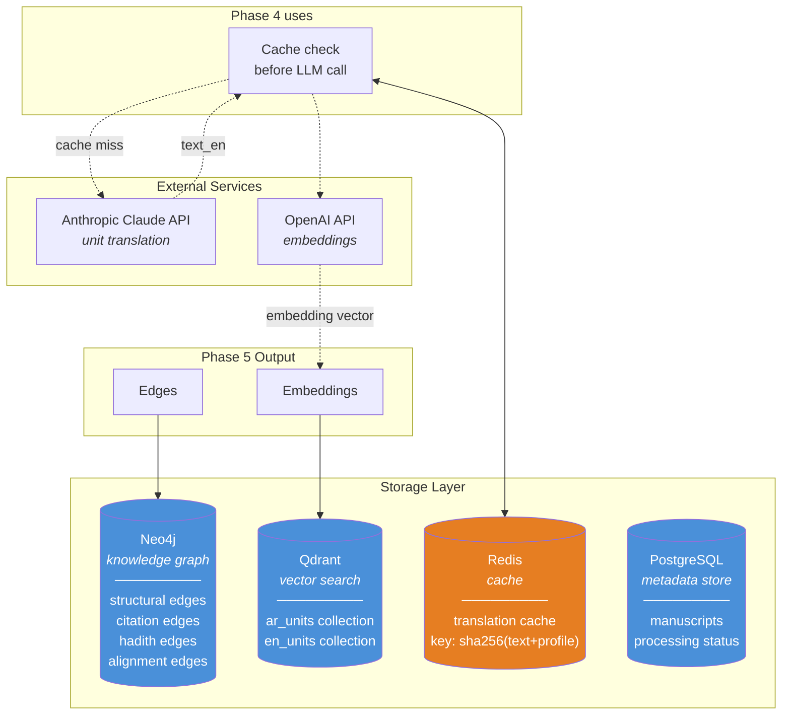
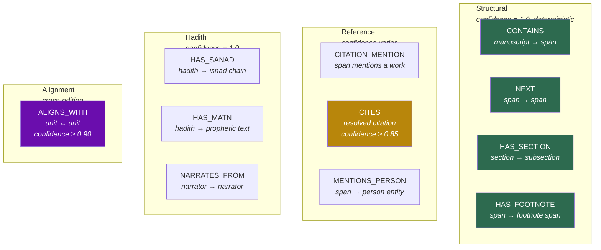
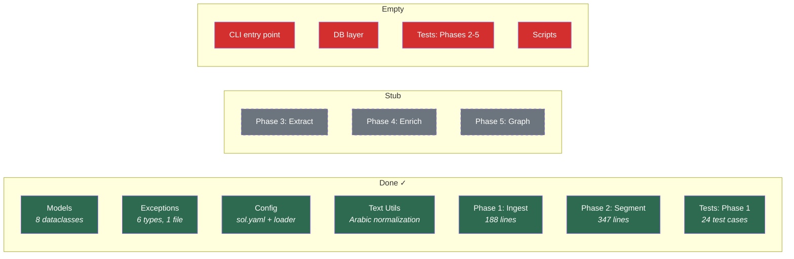

# SOL-NEXT Architecture

## About This Project

SOL-NEXT is a pipeline that transforms digitized classical Arabic manuscripts into a structured, searchable, multilingual knowledge graph. A scholar reading Ibn Hajar's *Fath al-Bari* can follow a hadith's isnad back through the narrators, trace its parallel transmissions across other collections, read the Arabic alongside an English translation, and discover which later scholars cited the same hadith.

The pipeline replaces ~47,000 lines of Python (the original `sol` codebase) with ~3,800 lines by collapsing intermediate representations and moving all domain knowledge into a single YAML configuration file.

---

## 1. Pipeline Overview

The entire pipeline is five function calls. Each phase reads from and writes to a single `Manuscript` object passed between them.

```mermaid
flowchart LR
    subgraph Input
        JSON["book.json<br/><i>digitized manuscript</i>"]
    end

    subgraph "Phase 1: INGEST"
        P1["Load JSON<br/>Normalize text<br/>Classify pages"]
    end

    subgraph "Phase 2: SEGMENT"
        P2["Split paragraphs<br/>Detect patterns<br/>Route behaviors<br/>Track hierarchy"]
    end

    subgraph "Phase 3: EXTRACT"
        P3["Run extractors<br/>Atomicize spans<br/>→ entities + units"]
    end

    subgraph "Phase 4: ENRICH"
        P4["Translate units<br/>Generate embeddings<br/><i>(async, cached)</i>"]
    end

    subgraph "Phase 5: GRAPH"
        P5["Build edges<br/>Resolve citations<br/>Align editions"]
    end

    subgraph Storage
        NEO4J[(Neo4j)]
        QDRANT[(Qdrant)]
    end

    JSON --> P1
    P1 -->|".pages"| P2
    P2 -->|".spans"| P3
    P3 -->|".entities .units"| P4
    P4 -->|".text_en .embedding"| P5
    P5 -->|"edges"| NEO4J
    P5 -->|"vectors"| QDRANT

    style P1 fill:#2d6a4f,color:#fff
    style P2 fill:#2d6a4f,color:#fff
    style P3 fill:#6c757d,color:#fff,stroke-dasharray: 5 5
    style P4 fill:#6c757d,color:#fff,stroke-dasharray: 5 5
    style P5 fill:#6c757d,color:#fff,stroke-dasharray: 5 5
```



> **Green** = implemented. **Grey dashed** = stub (contract defined, not yet built).

---

## 2. Data Model

One `Manuscript` carries everything. One `Span` type is progressively enriched — never rewrapped.



---

## 3. Span Progressive Enrichment

A `Span` is created in Phase 2 and enriched through Phase 5. It is never replaced or wrapped — downstream phases populate additional fields on the same object.



Check which phase a span has been through:
- Phase 2 complete → `span.behavior is not None`
- Phase 3 complete → `span.units is not None`
- Phase 4 complete → `span.units[0].embedding is not None`

---

## 4. Config-Driven Behavior Routing (Phase 2)

All domain knowledge lives in `config/sol.yaml`. Python executes the routing — it never contains patterns or thresholds.



---

## 5. Phase 2 Internal Flow

The most complex implemented phase. Splits pages into spans, detects patterns, routes behaviors, and tracks document hierarchy via a finite state machine.



---

## 6. Hierarchy Tracking FSM

Phase 2 tracks document structure using a `KitabBabFaslTracker`. When a `SECTION_HEADING` span is detected, the FSM updates its state based on the heading keyword.



Example hierarchy path for a span inside بَابُ الغُسْلِ within كِتَابُ الطَّهَارَةِ:

```
HierarchyPath(
    path=["كتاب الطهارة", "باب الغسل"],
    path_ids=["kitab_001", "bab_002"],
    depth=2
)
```

---

## 7. Phase 1 (Ingest) Flow



---

## 8. Planned Storage Architecture (Phase 5)



---

## 9. Knowledge Graph Edge Types



---

## 10. Implementation Status


